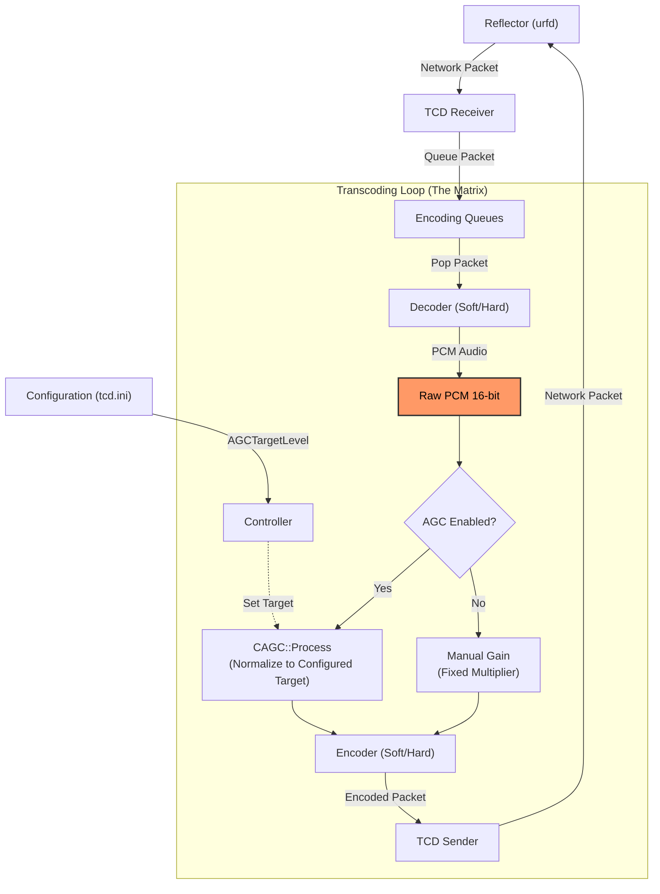
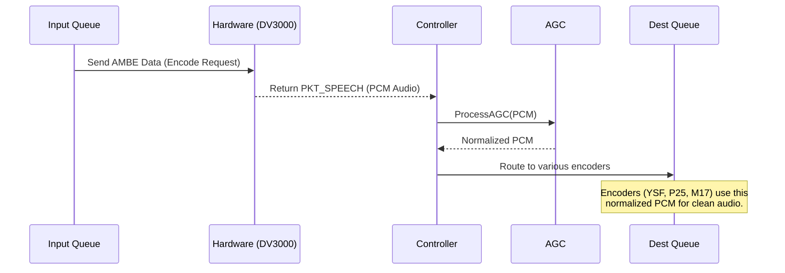
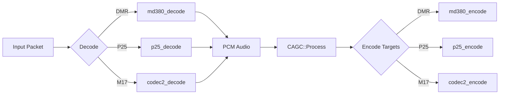

# TCD Architecture & Data Flow

This document details the internal data flow of the Transcoder (TCD) and the injection point of the Automatic Gain Control (AGC).

## High-Level Data Flow

`tcd` operates by receiving packets from a reflector (e.g., `urfd` or `xlxd`), decoding them to PCM Audio, and then re-encoding them to the target format(s) needed by other modules.

## Detailed Processing Threads

The transcoding is handled by specific threads depending on the input format.

### 1. Hardware Transcoding (DV3000/DV3003)

Used for D-Star and DMR (if software AMBE is disabled).

### 2. Software Transcoding (SWAMBE / IMBE / Codec2)

Used for DMR (Soft), P25, and M17.

## Configuration

1. **Parses `tcd.ini`**: Reads `AGC=1` and `AGCTargetLevel` (float).
2. **Controller**: Calculates linear target from dBFS and updates AGC instances.

## AGC Algorithm

The AGC uses a generic Peak Envelope Follower approach:

1. **Detect**: Track absolute peak level of incoming PCM (Fast Attack, Slow Release).
2. **Calculate**: Compare peak to Target Level (-3dBFS).
3. **Apply**: Adjust gain smoothly to match Target.
4. **Limit**: Hard limitation prevents clipping/wrap-around.

This ensures that loud inputs (like hot DMR users) are attenuated, and quiet inputs are boosted, normalizing the audio for all bridged modes.
